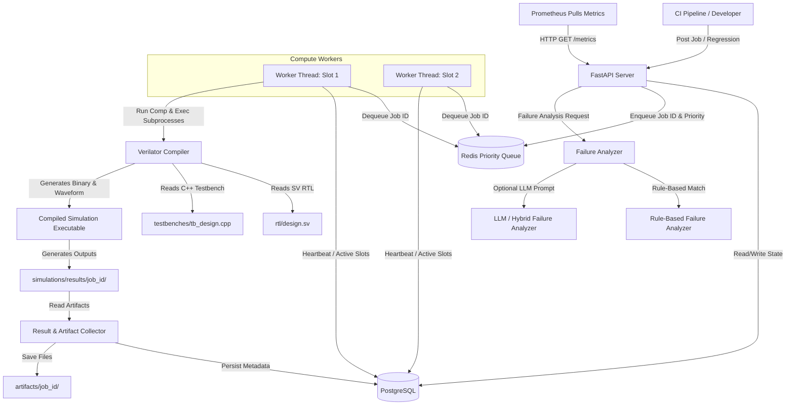

# CPU Design Automation & AI Debugging Platform

The **CPU Design Automation & AI Debugging Platform** is an enterprise-grade distributed software pipeline designed for compiling, running, scheduling, and automatically debugging CPU Register-Transfer Level (RTL) designs.

Built with a modern distributed architecture, it translates complex hardware simulation workflows into robust software engineering pipelines—enabling continuous integration (CI) automation, regression monitoring, and automated AI-assisted failure triage.

---

## 🚀 Key Features

* **Distributed Priority Scheduler**: Powered by **Redis** and **PostgreSQL**, facilitating high-concurrency simulation job queuing across multiple priority levels (`high`, `normal`, `low`) and worker thread isolation using dynamic thread pool execution.
* **Verilator Simulation Integration**: Automates the transpilation and cycle-accurate simulation of SystemVerilog RTL modules (ALU, FIFO, Register File, Cache) with C++ testbenches, generating waveform VCD output, coverage metrics, and detailed execution logs.
* **Hybrid & Intelligent Failure Triage**: 
  * **Rule-Based (Deterministic)**: Instantly catches known failure signatures (timeouts, compilation errors, assertions) via regular expressions to minimize latency and LLM costs.
  * **AI-Assisted (LLM)**: Packages bounded simulation evidence (logs, source context) and queries LLM backends (OpenAI, Gemini) to return structured JSON diagnostics validated using Pydantic schemas.
* **Log Clustering & Regression Analytics**: Normalizes error traces (stripping dynamic pointers/addresses) to group similar failure patterns into clusters, allowing engineers to fix one root cause and resolve hundreds of failures.
* **Observability & Metrics**: Native **Prometheus** metrics export (`/metrics`) exposing simulation throughput, failure rates, queue depths, API latencies, and LLM diagnostics for live **Grafana** visualization.
* **Secure Sandbox & Artifact Isolation**: Isolates local compiler workspaces and preserves output artifacts with strict SHA-256 checksum verification and protection against directory traversal attacks.

---

## 📐 System Architecture

The following diagram illustrates the lifecycle of a simulation job—from submission to scheduling, worker compilation, failure analysis, and metrics storage:



---

## 📁 Repository Structure

```
CPU-Design-Automation/
├── backend/
│   ├── app/
│   │   ├── main.py                # FastAPI Application & REST API Endpoints
│   │   ├── database.py            # SQLAlchemy Database Connection Setup
│   │   ├── models/
│   │   │   └── job.py             # Relational Database Models (Jobs, Attempts, Artifacts)
│   │   ├── schemas/
│   │   │   └── job.py             # Pydantic Input/Output Schemas
│   │   ├── queue/
│   │   │   └── redis_queue.py     # Redis priority queue & exponential backoff logic
│   │   ├── workers/
│   │   │   └── scheduler.py       # Compute Worker Daemon (simulation executor loop)
│   │   ├── simulation/
│   │   │   └── verilator.py       # Subprocess wrapper for the Verilator compiler
│   │   ├── debugging/
│   │   │   ├── analyzer.py        # Failure Analyzer Factory (Rule/LLM/Hybrid)
│   │   │   └── llm_provider.py    # OpenAI and Google Gemini API Integrations
│   │   └── utils/
│   │       └── checksum.py        # SHA-256 file hashing utilities
│   └── tests/
│       ├── test_api.py            # API controller tests
│       ├── test_integration.py    # Multi-node integration flows
│       └── test_milestone[2-6].py # Automated verification scripts
├── rtl/                           # Hardware Design Source Files
│   ├── alu/                       # Arithmetic Logic Unit Design (alu.sv)
│   ├── cache/                     # Direct-Mapped Cache Design (cache.sv)
│   ├── fifo/                      # Circular FIFO Queue Design (fifo.sv)
│   └── register_file/             # CPU Register File Design (reg_file.sv)
├── testbenches/                   # Cycle-Accurate Verilator C++ Drivers
│   ├── alu/                       # Passing & Failing ALU Testbenches
│   ├── cache/                     # Cache Verification Drivers
│   ├── fifo/                      # FIFO Queue Verifications
│   └── register_file/             # Register File Verifications
├── docker-compose.yml             # Local Multi-Container Services Orchestration
└── run_milestone6_demo.py         # Verification and intelligent debugging demo runner
```

---

## 🛠️ Getting Started

### Prerequisites

* [Docker](https://www.docker.com/) and Docker Compose installed.
* [Python 3.10+](https://www.python.org/) (for running local client demos).

### 1. Launch Services

Start the database (PostgreSQL), queue broker (Redis), API server, and compute worker using Docker Compose:

```bash
docker-compose up --build -d
```

### 2. Verify Services

Check that all containers are healthy:

```bash
docker-compose ps
```

The REST API will be available at `http://localhost:8000`. You can explore the interactive OpenAPI docs at `http://localhost:8000/docs`.

### 3. Run Automated Tests

To validate the implementation against the entire test suite, run the test container:

```bash
docker-compose run --rm test
```

---

## 🤖 Configuring AI-Assisted Debugging

The intelligent debugging module can be configured via environment variables. Create a `.env` file or export the following variables in the API & Worker containers:

```env
LLM_ENABLED=true
LLM_PROVIDER=openai # Or 'gemini'
LLM_MODEL=gpt-4o    # Or 'gemini-1.5-pro'
LLM_API_KEY=your-api-key-here
```

*If `LLM_ENABLED` is set to `false`, or if credentials are missing, the system gracefully falls back to deterministic rule analysis and logs the event.*

---

## 🔄 Job Lifecycles & State Transitions

Simulation jobs transition through the following states:

1. **`QUEUED`**: The job is stored in PostgreSQL and pushed to Redis.
2. **`RUNNING`**: A compute worker pops the job and locks it atomically.
3. **`PASSED`**: The simulation exits with status code `0`. Waveforms and logs are preserved.
4. **`RETRYING`**: If compilation or verification fails, the job uses exponential backoff (e.g., `2 * 2^(attempts-1)` seconds) via Redis Delayed Sorted Sets.
5. **`FAILED`**: If the job exceeds the maximum retry limit, it transitions to `FAILED`. Engineers can request manual debug/analysis or trigger revalidation.

---

## 🌐 API Reference Highlights

| Method | Endpoint | Description |
| :--- | :--- | :--- |
| `POST` | `/jobs` | Submits a simulation job (specifying design, test, priority). |
| `GET` | `/jobs/{job_id}` | Retrieves detailed metadata and status of a simulation. |
| `POST` | `/jobs/{job_id}/analyze` | Triggers a Hybrid/Rule/LLM failure diagnostics parse. |
| `POST` | `/jobs/{job_id}/revalidate`| Re-queues a failed simulation after local RTL/testbench edits. |
| `GET` | `/regressions/{id}/intelligence`| Computes clustering metrics, top root causes, and categories. |
| `GET` | `/metrics` | Exposes standard Prometheus operational metrics. |

---

## 🧪 Running Client Demos

Interactive Python scripts are provided to simulate and debug failures end-to-end:

### Milestone 6 (AI-Assisted & Hybrid Verification)
```bash
python run_milestone6_demo.py
```

### Milestone 5 (Regressions, Clustering & Histograms)
```bash
python run_milestone5_demo.py
```

### Milestone 4 (Queue Scheduling, Delayed Retries & Sandbox Integrity)
```bash
python run_milestone4_demo.py
```

---

## 📚 Deep Dive Documentation

For a comprehensive guide covering Verilator transpilation, RTL registers, database schemas, and metrics cardinality, refer to the **[Codebase Zero to Hero Guide](docs/CODEBASE_ZERO_TO_HERO.md)**.

