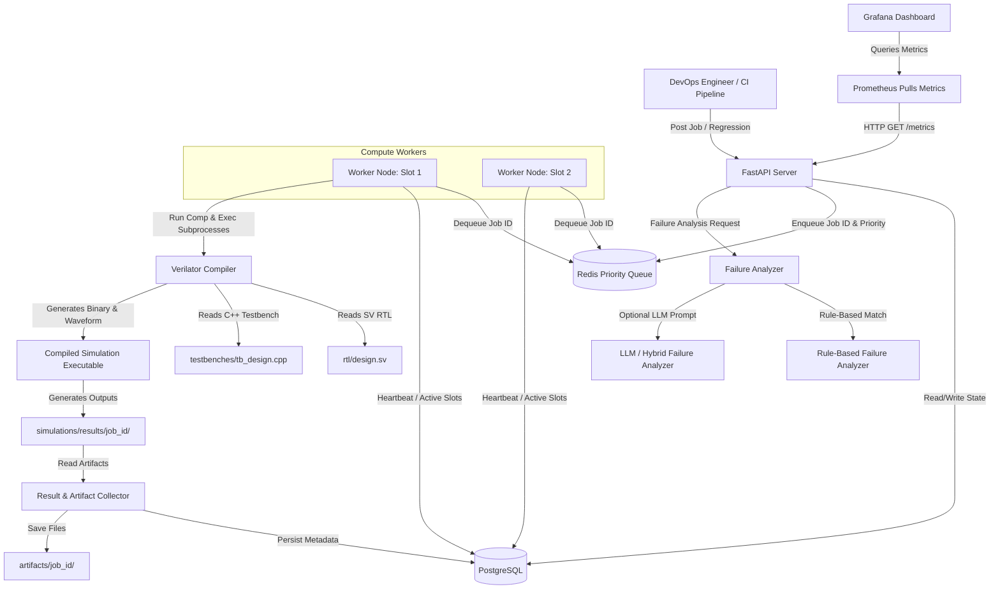

# Codebase Zero to Hero: CPU Design Automation & AI Debugging Platform

Welcome! This document is designed to take you from absolute zero knowledge of CPU design/EDA tools to an interview-ready, deep technical understanding of the **CPU Design Automation & AI Debugging Platform** in this repository. 

As a candidate for Intel's **Design Automation & DevOps Software Engineer** role, you do not need to be a hardware architect. Instead, your value lies in building the robust, highly scalable, and secure **software infrastructure** that compiles, simulates, schedules, and debugs hardware designs.

---

## 1. Architectural Blueprint (High-Level Overview)

Before diving into files and code, let's understand the flow of data. The platform follows a standard distributed system architecture for scheduling and executing batch workloads (in this case, hardware simulations).



---

## 2. Codebase Map

Here is the directory structure of the repository. For each important file, we describe its exact responsibility, files it interacts with, and what would break if it were removed.

```
CPU-Design-Automation/
├── backend/
│   ├── app/
│   │   ├── main.py                # FastAPI Application & API Endpoints
│   │   ├── database.py            # SQLAlchemy PostgreSQL Engine & Session
│   │   ├── models/
│   │   │   └── job.py             # SQLAlchemy Database Models (SimulationJob, etc.)
│   │   ├── schemas/
│   │   │   └── job.py             # Pydantic Schemas for Request/Response Validation
│   │   ├── queue/
│   │   │   └── redis_queue.py     # Redis Connection & Priority Queue Interface
│   │   ├── workers/
│   │   │   └── scheduler.py       # Compute Worker Daemon (Heartbeat & Execution Loop)
│   │   ├── simulation/
│   │   │   └── verilator.py       # Wrapper for Subprocess Verilator Commands
│   │   ├── debugging/
│   │   │   ├── analyzer.py        # Failure Analyzer Factory & Logic (Rule/LLM/Hybrid)
│   │   │   └── llm_provider.py    # Abstraction for OpenAI/Gemini API calls
│   │   └── utils/
│   │       └── checksum.py        # SHA-256 Utility for Artifact Integrities
│   └── tests/
│       ├── test_api.py            # Unit tests for API endpoints
│       ├── test_integration.py    # E2E integration test verification
│       └── test_milestone[2-6].py # Milestone-specific validation tests
├── rtl/                           # Hardware Design Source Directories
│   ├── alu/alu.sv                 # Arithmetic Logic Unit RTL
│   ├── fifo/fifo.sv               # First-In, First-Out Queue RTL
│   ├── register_file/reg_file.sv  # CPU Register File RTL
│   └── cache/cache.sv             # Direct-Mapped Cache RTL
├── testbenches/                   # Verilator C++ Driver/Verification Files
│   ├── alu/                       # tb_alu_pass.cpp & tb_alu_fail.cpp
│   ├── fifo/                      # tb_fifo_pass.cpp & tb_fifo_fail.cpp
│   ├── register_file/             # tb_register_file_pass.cpp & tb_register_file_fail.cpp
│   └── cache/                     # tb_cache_pass.cpp & tb_cache_fail.cpp
├── docker-compose.yml             # Orchestration for Database, Cache, API, Workers
├── scripts/
│   └── benchmark.py               # E2E Performance & Reliability Testing Script
└── pyproject.toml                 # Project metadata & PyTest configs
```

### Important Files Deep Dive

1. **[`backend/app/main.py`](file:///d:/VS/CPU-Design-Automation/backend/app/main.py)**
   - **What it is:** The entrypoint of the FastAPI web application.
   - **Responsibility:** Defines HTTP API endpoints (`GET /jobs`, `POST /jobs`, `POST /jobs/{id}/analyze`, `/regressions`, `/metrics`). It also seeds default designs on boot.
   - **Interactions:** Uses SQLAlchemy sessions from `database.py`, models from `models/job.py`, schema validations from `schemas/job.py`, pushes jobs to `queue/redis_queue.py`, and triggers analysis via `debugging/analyzer.py`.
   - **What breaks if removed:** Entire HTTP API shuts down; no clients (including regression scripts or frontend wrappers) can communicate with the platform.

2. **[`backend/app/database.py`](file:///d:/VS/CPU-Design-Automation/backend/app/database.py)**
   - **What it is:** Database engine creation and session builder.
   - **Responsibility:** Establishes connection to PostgreSQL using SQLAlchemy, configures connection pool, and exposes `get_db()` dependency injection.
   - **Interactions:** Loaded by `main.py` and `workers/scheduler.py` to get database connections.
   - **What breaks if removed:** No persistent state can be stored. The app cannot launch as models cannot bind to the database.

3. **[`backend/app/models/job.py`](file:///d:/VS/CPU-Design-Automation/backend/app/models/job.py)**
   - **What it is:** Database schema definitions.
   - **Responsibility:** Declares SQLAlchemy ORM classes (`SimulationJob`, `SimulationAttempt`, `FailureAnalysis`, `WorkerStatus`, `SimulationArtifact`, `Design`, `RegressionRun`).
   - **Interactions:** Imported by `main.py`, `database.py`, and `workers/scheduler.py` for queries and updates.
   - **What breaks if removed:** Relational table mapping is lost; Python code cannot query or update rows in PostgreSQL.

4. **[`backend/app/queue/redis_queue.py`](file:///d:/VS/CPU-Design-Automation/backend/app/queue/redis_queue.py)**
   - **What it is:** Redis client configuration and messaging broker logic.
   - **Responsibility:** Handles atomic pushes (`lpush`) and blocking pops (`brpop`) across priority-specific Redis lists (`queue:high`, `queue:normal`, `queue:low`, `delayed_jobs`).
   - **Interactions:** Pushed to by `main.py` (when a job is posted); popped from by `workers/scheduler.py` (when a slot becomes free).
   - **What breaks if removed:** High-concurrency job scheduling breaks. Workers must poll PostgreSQL continuously (causing database lock contention) instead of listening to a push-based queue.

5. **[`backend/app/workers/scheduler.py`](file:///d:/VS/CPU-Design-Automation/backend/app/workers/scheduler.py)**
   - **What it is:** The main compute execution worker daemon.
   - **Responsibility:** Runs worker heartbeat loop reporting node statistics (CPU/memory), monitors delayed tasks, pulls job IDs from Redis, coordinates concurrency using a `ThreadPoolExecutor`, compiles/runs RTL simulations, and saves generated output logs, waveforms, and code coverages.
   - **Interactions:** Interacts with `redis_queue.py` (dequeue), `database.py` (persist job/attempt results), `simulation/verilator.py` (subprocess simulator execution), and uses checksum utility from `utils/checksum.py`.
   - **What breaks if removed:** Simulation jobs will sit in the queue forever. No compute execution happens.

6. **[`backend/app/simulation/verilator.py`](file:///d:/VS/CPU-Design-Automation/backend/app/simulation/verilator.py)**
   - **What it is:** Subprocess wrapper for the Verilator compiler.
   - **Responsibility:** Generates exact shell command parameters to invoke `verilator` compilation (building C++ files from SystemVerilog RTL) and runs the output binary safely with trace/coverage flags.
   - **Interactions:** Called by `workers/scheduler.py` to run the actual simulation.
   - **What breaks if removed:** The scheduler can no longer compile or run hardware designs. It cannot detect syntax warnings or run binary testbenches.

7. **[`backend/app/debugging/analyzer.py`](file:///d:/VS/CPU-Design-Automation/backend/app/debugging/analyzer.py)**
   - **What it is:** Simulation log failure analysis engine.
   - **Responsibility:** Factory class that instantiates deterministic regex rules (`RuleBasedFailureAnalyzer`), OpenAI/Gemini prompt orchestrator (`LLMFailureAnalyzer`), or a hybrid combination (`HybridFailureAnalyzer`) that processes exit codes, stdout, and stderr to locate failing code and write a suspected root cause.
   - **Interactions:** Instantiated in `main.py` under the `/jobs/{id}/analyze` and `/jobs/{id}/debug` endpoints. Uses `debugging/llm_provider.py`.
   - **What breaks if removed:** The platform loses self-healing and AI debugging capability; test failure categorization (e.g., distinguishing a compile error from a verification assertion) becomes manual.

---

## 3. Teaching the System from Zero (Hardware Simulation for Software Engineers)

If you have never worked with EDA (Electronic Design Automation) tools, terms like "compile RTL" or "testbench" can sound foreign. Let's translate these concepts using simple software engineering analogies.

### What is Hardware?
Software consists of instructions loaded into RAM and executed sequentially by a processor. Hardware is the physical layout of silicon transistors, registers, and wires that routes electricity through gates (AND, OR, NOT) to compute results in parallel.

### What is a CPU?
A Central Processing Unit is a specific hardware circuit designed to fetch instructions from memory, decode them, execute operations (add, shift, logic) using an ALU, write outputs back to registers, and start over.

### What is RTL?
**Register-Transfer Level (RTL)** is a design abstraction used to describe how data flows between registers (storage units) and combinational logic (computational gates) during clock cycles. 

### What is Verilog / SystemVerilog?
It is a **Hardware Description Language (HDL)**. Although SystemVerilog looks like C/Java, it behaves entirely differently. In software, statements execute one after another. In HDL, everything is active simultaneously because electricity flows through all components at once.
For example, look at the ALU code in [`rtl/alu/alu.sv`](file:///d:/VS/CPU-Design-Automation/rtl/alu/alu.sv):
```systemverilog
module alu (
    input logic [31:0] a,
    input logic [31:0] b,
    input logic [2:0]  op,
    output logic [31:0] result
);
    always_comb begin
        case (op)
            3'b000: result = a + b;
            3'b001: result = a - b;
            ...
        endcase
    end
endmodule
```
- **Inputs:** Wires feeding data (`a`, `b`) and operational instructions (`op`).
- **Outputs:** Wire forwarding the result (`result`).
- **`always_comb`:** Indicates that as soon as `a`, `b`, or `op` changes, the output updates instantly (combinational logic, no clock needed).

### What is a Testbench?
In software, you test a function using unit test frameworks (like PyTest or JUnit) by passing parameters and asserting outputs.
In hardware, a **testbench** is a program that wraps the RTL design, drives inputs (stimulus), toggles clock signals, and asserts that the output pins match the expected hardware specification. In this codebase, our testbenches are written in **C++** to run high-performance simulations.

### What is Simulation?
Fabricating silicon chips costs millions of dollars. If there is a single bug in your design, the chip is useless. Simulation is the process of running a virtual model of your hardware design on a normal CPU to verify its behavior before physical manufacturing.

### What is Verilator?
Verilator is a popular open-source tool that compiles SystemVerilog code (RTL) into highly optimized C++ code, which can then be compiled into a standard OS binary executable. This process is called "Cycle-Accurate Simulation".

### What does "Compile RTL" actually mean?
When you compile software, you generate machine code for a target CPU. When you "compile RTL" via Verilator, you:
1. Translate SystemVerilog (`alu.sv`) into equivalent C++ classes (`Valu.h`, `Valu.cpp`).
2. Combine those classes with a C++ testbench (`tb_alu_pass.cpp`).
3. Compile the whole C++ package using a compiler (like `g++` or `clang++`) to generate a simulation executable binary (`Valu`).

### What does the generated executable do?
When run, the executable instantiates the hardware simulation, steps through time, toggles clock cycles, evaluates the C++ inputs applied to the translated pins, and exits. 
- **`stdout/stderr`**: Contains log outputs generated during simulation (e.g. `std::cout` statements).
- **`exit code`**: `0` means all assertions in the testbench passed. Any non-zero code (`1`, etc.) indicates a failure.
- **Waveform (`waveform.vcd`)**: A file recording the exact state (high or low voltage) of every internal register and wire at every unit of simulation time. This file is opened in a waveform viewer (like GTKWave) to debug issues.

### Why do hardware engineers need millions of runs?
Hardware designs are extremely complex state machines. A modern processor has trillions of possible states. Engineers run "regressions"—running thousands of different stimulus testbenches across multiple designs—to find bugs in corner cases. This requires a scalable, distributed software queue to schedule workloads.

---

## 4. Tracing a Passing Job End-to-End

Let's trace a successful ALU test (`design_name: "alu"`, `test_name: "pass"`) from the moment an engineer submits it, all the way to database persistence and metric collection.

```
Engineer
  ↓ (HTTP POST /jobs with JSON)
[main.py: create_job()]
  ↓ (Reads Design Registry table; validates design paths)
[PostgreSQL: SimulationJob created with ID, status="QUEUED"]
  ↓ (Calls enqueue_job(job_id, priority))
[Redis: LPUSH queue:normal with job_id JSON]
  ↓ (Redis yields data to worker)
[scheduler.py: worker_slot_loop() invokes dequeue_job()]
  ↓ (worker updates SimulationJob state to status="RUNNING")
[PostgreSQL: SimulationJob status updated to 'RUNNING', worker_id set]
  ↓ (verilator.py: run_verilator() compiled simulation command)
[Subprocess: verilator --trace --cc alu.sv --exe tb_alu_pass.cpp -Mdir obj_dir --build]
  ↓ (Subprocess runs compiled simulation binary)
[Subprocess: ./obj_dir/Valu]
  ↓ (Binary exits with returncode 0)
[scheduler.py: process_job() receives result]
  ↓ (Creates new attempt record, status="PASSED", exit_code=0)
[PostgreSQL: SimulationAttempt record created]
  ↓ (Copies waveform.vcd & logs to artifacts storage)
[File System: saved to artifacts/job_id/attempt-1/waveform.vcd]
  ↓ (Calculates SHA-256 for saved files)
[PostgreSQL: SimulationArtifact records created]
  ↓ (Updates parent SimulationJob record status)
[PostgreSQL: SimulationJob updated to status='PASSED']
  ↓ (Prometheus collects updated metrics)
[GET /metrics: simulation_jobs_success_total incremented]
```

### Detailed Trace Data Flow:

1. **POST `/jobs` Submission**
   - **File:** [`backend/app/main.py`](file:///d:/VS/CPU-Design-Automation/backend/app/main.py#L87-L115)
   - **Function:** `create_job(job: JobCreate, db: Session)`
   - **Data:** Receives `JobCreate` schema (`design_name="alu"`, `test_name="pass"`, `priority="normal"`).
   - **Logic:** Queries the `Design` registry table. It finds the `alu` design record, resolving the RTL path to `rtl/alu/alu.sv` and the testbench path to `testbenches/alu/tb_alu_pass.cpp`.

2. **Database Insertion & Queue**
   - **Logic:** Creates a `SimulationJob` record.
   - **Database Action:** `INSERT INTO simulation_jobs (id, design_name, test_name, status, priority, rtl_path, testbench_path) VALUES ('uuid-123', 'alu', 'pass', 'QUEUED', 'normal', 'rtl/alu/alu.sv', 'testbenches/alu/tb_alu_pass.cpp')`.
   - **Queue Trigger:** Calls `enqueue_job(job_id='uuid-123', priority='normal')` from `queue/redis_queue.py`.
   - **Redis Action:** Executes `LPUSH queue:normal '{"job_id": "uuid-123", "priority": "normal"}'`.

3. **Worker Dequeuing**
   - **File:** [`backend/app/workers/scheduler.py`](file:///d:/VS/CPU-Design-Automation/backend/app/workers/scheduler.py#L325-L337)
   - **Function:** `worker_slot_loop()` calls `dequeue_job(timeout=5)`.
   - **Redis Action:** Worker thread performs blocking pop: `BRPOP [queue:high, queue:normal, queue:low] timeout=5`. Redis pops the payload, yielding `job_id: "uuid-123"`.

4. **Claiming the Job & State Locking**
   - **Function:** `process_job(job_id='uuid-123')`
   - **Database Action (Atomic Update):**
     ```sql
     UPDATE simulation_jobs 
     SET status = 'RUNNING', started_at = NOW(), worker_id = 'worker-1' 
     WHERE id = 'uuid-123' AND status IN ('QUEUED', 'RETRYING')
     ```
     This query checks the rows affected. If `updated_rows == 0`, another worker grabbed it, so this thread skips it, preventing race conditions.
   - **Heartbeat Change:** The worker thread increments `active_slots`. The heartbeat thread (`run_heartbeat()`) wakes up, detects `active_slots = 1`, and updates `worker_statuses` to show CPU/Memory and `status="AVAILABLE"` (since it is below concurrency capacity).

5. **Executing Verilator Compiler**
   - **File:** [`backend/app/simulation/verilator.py`](file:///d:/VS/CPU-Design-Automation/backend/app/simulation/verilator.py#L5-L69)
   - **Function:** `run_verilator()`
   - **Subprocess Action:** Invokes:
     ```bash
     verilator --trace --cc /app/rtl/alu/alu.sv --exe /app/testbenches/alu/tb_alu_pass.cpp -Mdir /app/simulations/results/uuid-123/obj_dir --build -Wall
     ```
     *Note:* Subprocess is called with `capture_output=True` and `shell=False` for security.
   - **Result:** Returns `compile_result.returncode == 0`. Next, it runs the compiled executable:
     ```bash
     /app/simulations/results/uuid-123/obj_dir/Valu
     ```
     This execution dumps simulation ticks, performs tests, writes signal data to `/app/simulations/results/uuid-123/waveform.vcd`, prints `"All passing tests completed successfully."` to stdout, and exits with code `0`.

6. **Updating Results & Artifact Persistence**
   - **Function:** `process_job()` receives `exit_code = 0`. Since `exit_code == 0`, status will be `PASSED`.
   - **Database Action (Attempt Creation):** Inserts a row into `SimulationAttempt` tracking attempt #1, runtime, status (`PASSED`), stdout, and stderr.
   - **File Action:** Reads `waveform.vcd` from `/app/simulations/results/uuid-123/` and copies it to `/app/artifacts/uuid-123/attempt-1/waveform.vcd`. It also saves stdout, stderr, compile logs, and simulation logs.
   - **Integrity Action:** Calls `calculate_sha256()` on each saved artifact to generate checksums.
   - **Database Action (Artifact Creation):** For each file, inserts a row into `SimulationArtifact` containing the file path, size, and checksum.
   - **Database Action (Job Complete):** Updates the parent job record:
     ```sql
     UPDATE simulation_jobs 
     SET status = 'PASSED', completed_at = NOW(), exit_code = 0, runtime_ms = X 
     WHERE id = 'uuid-123'
     ```
   - **Cleanup:** Thread-safe lock decrements `active_slots`. Directory `/app/simulations/results/uuid-123` is deleted to conserve space.

7. **Metrics Exposure**
   - **Endpoint:** `GET /metrics` in `main.py`
   - **Logic:** Queries PostgreSQL counts. The next scraping interval fetches `simulation_jobs_success_total` which has incremented by 1.

---

## 5. Tracing a Failing Job and AI Remediation Workflow

Let's follow the execution pipeline when the ALU fails (`design_name: "alu"`, `test_name: "fail"`).

```
1. Submission & Execution: Job is queued, worker compiles it.
2. Execution Failure:
   - Binary ./Valu executes.
   - Reaches assertion line: top->result != 999.
   - Prints: "Assertion failed: Expected 999 but got 30".
   - Exits with returncode 1.
3. Post-Sim Categorization:
   - scheduler.py catches exit_code = 1.
   - Calls classify_failure(1, stdout, stderr) which scans for patterns.
   - Finds "assertion" or "assert" in logs.
   - Failure category marked as "ASSERTION_FAILURE".
4. Persistence & Queueing (First Attempt):
   - Inserts SimulationAttempt (status="FAILED", category="ASSERTION_FAILURE").
   - Artifacts (stdout, stderr, waveform.vcd) saved.
   - Check if attempt_count <= max_retries. 
     - If max_retries=1: Job status set to "RETRYING".
     - Delay calculated: 2 ** (1 - 1) * 2 = 2 seconds.
     - Pushed to delayed_jobs set in Redis.
5. Delayed Job Worker:
   - Background thread run_delayed_jobs_manager() polls delayed jobs.
   - Once 2s elapse, it moves job back to queue:normal.
   - Worker picks it up for attempt #2. Still fails assertion.
   - Since attempt_count (2) > max_retries (1), status set to "FAILED".
6. Analysis Phase:
   - Engineer calls POST /jobs/uuid-fail/analyze.
   - FastAPI invokes analyze_job() with "hybrid" mode.
   - Checks database cache: any matching failures for 'alu' and 'ASSERTION_FAILURE' with same normalized logs?
     - If yes: Reuses analysis, inserts FailureAnalysis row, returns instantly.
     - If no cache match: Resolves FailureAnalyzer.
7. Hybrid Failure Analyzer:
   - Calls RuleBasedFailureAnalyzer first. Runs regex check.
   - Finds assertion lines. Confidence = 1.0. Category = "ASSERTION_FAILURE".
   - (Since confidence is >= 0.95, it stops here and skips LLM).
   - If confidence was low: Invokes LLMFailureAnalyzer.
8. LLM Failure Analyzer (If invoked):
   - Formulates bounded JSON evidence package (truncating logs to 2000 chars, stripping credentials).
   - Checks LLM_ENABLED=true. Calls OpenAI/Gemini API with system instructions.
   - Receives structured JSON response containing:
     { "suspected_root_cause": "Testbench expects 999 but ALU addition of 10+20 returned 30", ... }
   - Validates response using LLMDiagnosis Pydantic model.
9. Persistence:
   - Inserts FailureAnalysis record. Updates SimulationJob.remediation column.
```

---

## 6. Database Deep Dive & Relational Schema

Here are the details of the tables mapped by the SQLAlchemy models in [`backend/app/models/job.py`](file:///d:/VS/CPU-Design-Automation/backend/app/models/job.py):

```
+------------------------------------+          +------------------------------------+
|           SimulationJob            |          |         SimulationAttempt          |
+------------------------------------+          +------------------------------------+
| id (PK)                            |<--------| job_id (FK)                        |
| design_name                        |          | attempt_number                     |
| test_name                          |          | status                             |
| status (QUEUED, RUNNING, ...)      |          | exit_code                          |
| priority                           |          | runtime_ms                         |
| exit_code                          |          | stdout, stderr                     |
| remediation                        |          | triggering_analysis_id (FK)--------+
| regression_id (FK)                 |--+       +------------------------------------+     |
| triggering_analysis_id (FK)        |- |--------------------------------------------+ |
+------------------------------------+  |                                            | |
                                        |                                            | |
+------------------------------------+  |       +------------------------------------+ |
|           RegressionRun            |  |       |          FailureAnalysis           | |
+------------------------------------+  |       +------------------------------------+ |
| id (PK)                            |<-+       | id (PK) <--------------------------+-+
| name                               |          | job_id (FK)                        |
| status                             |          | analyzer_type                      |
| total_jobs, passed_jobs, etc.      |          | failure_category                   |
+------------------------------------+          | suspected_root_cause               |
                                                | recommended_fix                    |
+------------------------------------+          +------------------------------------+
|         SimulationArtifact         |
+------------------------------------+          +------------------------------------+
| id (PK)                            |          |               Design               |
| job_id (FK)                        |          +------------------------------------+
| attempt_id (FK) ------------------>|          | id (PK)                            |
| artifact_type (waveform, etc.)     |          | name (Index, Unique)               |
| path, size_bytes, checksum         |          | rtl_path, testbench_path           |
+------------------------------------+          +------------------------------------+
```

### Table Lifecycles and Field Descriptions

* **`Design`**:
  * **Purpose:** Stores paths to registered RTL modules and testbench directories. Used to validate design paths and map names during submission.
  * **Lifecycle:** Seeded at startup with core designs (`alu`, `fifo`, `register_file`, `cache`) or modified via `POST /designs`.

* **`SimulationJob`**:
  * **Purpose:** Holds metadata for simulation pipelines.
  * **Fields:** `status` (monitors state), `attempt_count` (increments per execution), `remediation` (caching LLM solutions), `triggering_analysis_id` (tracks which analysis caused a revalidation).

* **`SimulationAttempt`**:
  * **Purpose:** Tracks separate run executions. This is key because a single job can run multiple times due to retry policies or revalidation fixes.

* **`SimulationArtifact`**:
  * **Purpose:** Stores files generated by runs. Contains `checksum` (SHA-256 integrity hash) and `size_bytes`. Matches both `job_id` and `attempt_id`.

* **`FailureAnalysis`**:
  * **Purpose:** Records failure investigations. Contains AI fields: `confidence` (0.0 to 1.0), `affected_component`, and `suggested_next_test`.

* **`RegressionRun`**:
  * **Purpose:** Groups multiple runs representing a unified suite verification execution.

---

## 7. State Machine

Here is the exact job state machine implemented in the codebase.

```
       [Job Created]
             │
             v
         +--------+
         | QUEUED | <───────────────────────────────────────────+
         +--------+                                             │
             │                                                  │
      (Worker Dequeues)                                         │
             │                                                  │
             v                                                  │
        +---------+                                             │
        | RUNNING |                                             │
        +---------+                                             │
         /       \                                              │
        /         \                                             │
 (Exit Code 0)  (Exit Code != 0)                                │
      /             \                                           │
     v               v                                          │
+--------+     +-----------+                                    │
| PASSED |     |  FAILED   | ──(Revalidate / POST /jobs/retry)──+
+--------+     +-----------+
                     │
              (Retry Policy)
                     │
                     v
                +----------+
                | RETRYING | ──(Exponential Backoff Wait)───────+
                +----------+
```

### Transition Mechanics:

1. **`QUEUED` ➔ `RUNNING`**:
   - **Trigger:** Worker pulls job ID from Redis.
   - **Database Action:** Atomic `UPDATE ... WHERE status IN ('QUEUED', 'RETRYING')`. If the transaction succeeds, the worker proceeds. This state transition lock prevents duplicate executions.

2. **`RUNNING` ➔ `PASSED`**:
   - **Trigger:** Verilator execution exits with `0`.
   - **Database Action:** Set status to `PASSED`, save run timestamps.

3. **`RUNNING` ➔ `RETRYING`**:
   - **Trigger:** Simulation failure exits with non-zero code, and `attempt_count <= max_retries`.
   - **Queue Action:** Exponential backoff delay calculation (`delay = 2 ** (attempts - 1) * 2`). Worker pushes metadata into `delayed_jobs` sorted set.

4. **`RUNNING` ➔ `FAILED`**:
   - **Trigger:** Simulation exits with non-zero code, and `attempt_count > max_retries`.
   - **Database Action:** Status set to `FAILED`.

5. **`FAILED` ➔ `QUEUED`**:
   - **Trigger:** User requests manual retry via `POST /jobs/{id}/retry` or triggers a revalidation run via `/jobs/{id}/revalidate` after applying code repairs.

---

## 8. Redis and Queues Deep Dive

Redis acts as our orchestration message broker. Let's look at the implementation in [`backend/app/queue/redis_queue.py`](file:///d:/VS/CPU-Design-Automation/backend/app/queue/redis_queue.py).

### Queues Used:
- **`queue:high`**: High priority simulation jobs.
- **`queue:normal`**: Default priority simulation jobs.
- **`queue:low`**: Low priority simulation jobs (e.g. night-time regressions).
- **`delayed_jobs`**: Redis Sorted Set (`zset`) holding failed runs waiting to be retried.

### Core Operations:

* **Enqueueing a Job (`enqueue_job`)**:
  Appends job ID to a specific priority list.
  ```python
  redis_client.lpush(queue_name, json.dumps({"job_id": job_id, "priority": priority}))
  ```

* **Dequeuing a Job (`dequeue_job`)**:
  Pops data in priority order.
  ```python
  redis_client.brpop(["queue:high", "queue:normal", "queue:low"], timeout=timeout)
  ```
  `BRPOP` checks lists from left to right. If a high-priority job is present, it is popped immediately. Normal and low priority jobs wait until higher queues are empty.

* **Exponential Backoff (`enqueue_delayed_job`)**:
  Adds a retry task to `delayed_jobs` sorted set. The score in the sorted set is set to `current_timestamp + delay_seconds`.
  ```python
  redis_client.zadd("delayed_jobs", {json.dumps(job_data): run_at})
  ```
  The scheduler thread runs `process_delayed_jobs()` once per second, querying `zrangebyscore("delayed_jobs", 0, now)`. If a job's scheduled execution time has passed, it is atomically removed from the set (`zrem`) and pushed back to the active queue.

### Redis Failover:
If Redis goes down, the client raises a `ConnectionError`. In our design, the API and workers rely on Redis for queuing. If Redis crashes, job routing will fail. However, database transactions are managed by PostgreSQL, ensuring metadata integrity.

---

## 9. Compute Workers and Concurrency

A worker is a background process running the daemon located in [`backend/app/workers/scheduler.py`](file:///d:/VS/CPU-Design-Automation/backend/app/workers/scheduler.py).

### How Concurrency Works:
Workers do not spawn separate OS processes for concurrency. Instead, they use Python's `ThreadPoolExecutor` matching a configurable `WORKER_CONCURRENCY` limit:
```python
with ThreadPoolExecutor(max_workers=WORKER_CONCURRENCY) as executor:
    for _ in range(WORKER_CONCURRENCY):
        executor.submit(worker_slot_loop)
```
Each thread runs a loop that blocks on `dequeue_job()`. When a simulation is dequeued, it runs Verilator commands using `subprocess.run()`. This design allows multiple compilations and simulations to run concurrently.

### Slot & Workload Isolation:
- **Temporary Output Directory:** Every run creates a directory path `/app/simulations/results/{job_id}/`. Verilator places compilation files and binary builds in this isolated directory.
- **Thread Safety:** System statistics (CPU/Memory) and active slots are monitored using a thread lock:
  ```python
  active_slots_lock = threading.Lock()
  ```

### Worker Crashes:
If a worker daemon crashes, active jobs remain in the `RUNNING` state. A production cleanup manager (or manual pipeline script) would identify orphaned jobs where `last_heartbeat` is outdated and queue them again.

---

## 10. Verilator and Simulation Pipeline

Verilator processes designs using the following stages:

```
[SystemVerilog RTL] + [C++ Testbench]
                │
                ▼ (Compilation Phase)
   verilator --trace --cc alu.sv --exe tb_alu_pass.cpp -Mdir obj_dir --build
                │
                ▼ (Transpilation Phase)
        [C++ Classes generated inside obj_dir/]
                │
                ▼ (Linking & Build Phase)
        [g++ Compiles C++ code into Binary]
                │
                ▼ (Execution Phase)
             ./obj_dir/Valu
                │
                ▼ (Logs & Waveforms)
        [stdout/stderr] & [waveform.vcd]
```

### Compiler Flags Explained:
* **`--trace`**: Tells Verilator to generate C++ trace code. This enables dumping signals to VCD format.
* **`--cc`**: Compiles the SystemVerilog design into C++ classes.
* **`--exe`**: Includes the user-defined C++ driver/testbench code in compilation.
* **`-Mdir obj_dir`**: Specifies the target build output directory.
* **`--build`**: Automatically builds the executable binary using `make` after generation.
* **`-Wall`**: Enables all warning checks, helping find syntax issues during compilation.
* **`--coverage`**: Optional flag to enable code coverage monitoring.

---

## 11. RTL and Testbench Deep Dive

Let's study the hardware modules in the repository and walk through their testbenches.

### 1. Arithmetic Logic Unit (ALU)
- **Module:** [`rtl/alu/alu.sv`](file:///d:/VS/CPU-Design-Automation/rtl/alu/alu.sv)
- **RTL Logic:** Combines operands based on `op` input logic:
  - `000` ➔ Add (`a + b`)
  - `001` ➔ Subtract (`a - b`)
  - `010` ➔ Bitwise AND (`a & b`)
  - `011` ➔ Bitwise OR (`a | b`)
  - `100` ➔ Bitwise XOR (`a ^ b`)
- **Passing Testbench:** [`testbenches/alu/tb_alu_pass.cpp`](file:///d:/VS/CPU-Design-Automation/testbenches/alu/tb_alu_pass.cpp)
  - Instantiates `Valu` simulation class.
  - Sets input signals: `top->a = 10; top->b = 20; top->op = 0;` (ADD).
  - Evaluates logic: `top->eval();`.
  - Asserts expected output: `if (top->result != 30) { return 1; }`
- **Failing Testbench:** [`testbenches/alu/tb_alu_fail.cpp`](file:///d:/VS/CPU-Design-Automation/testbenches/alu/tb_alu_fail.cpp)
  - Applies inputs and asserts a failing result:
    ```cpp
    if (top->result != 999) {
        std::cerr << "Assertion failed: Expected 999 but got " << top->result << std::endl;
        return 1;
    }
    ```

### 2. First-In, First-Out Queue (FIFO)
- **Module:** [`rtl/fifo/fifo.sv`](file:///d:/VS/CPU-Design-Automation/rtl/fifo/fifo.sv)
- **Description:** A circular queue buffer storing values sequentially. Uses two ports: `wr_en` (write enable) and `rd_en` (read enable) driven by a clock signal.
- **RTL Logic:**
  - On write (`wr_en` and not `full`), stores `din` to `mem[wr_ptr]` and increments pointer.
  - On read (`rd_en` and not `empty`), outputs data to `dout` and increments pointer.
  - Updates a `count` register to compute status flags: `full = (count == DEPTH)` and `empty = (count == 0)`.
- **Passing Testbench:** [`testbenches/fifo/tb_fifo_pass.cpp`](file:///d:/VS/CPU-Design-Automation/testbenches/fifo/tb_fifo_pass.cpp)
  - Configures clock ticks. Asserts that the queue is empty after reset. Writes `42` to the queue, reads it back, and verifies that `dout == 42`.
- **Failing Testbench:** [`testbenches/fifo/tb_fifo_fail.cpp`](file:///d:/VS/CPU-Design-Automation/testbenches/fifo/tb_fifo_fail.cpp)
  - Performs same write/read sequence but expects the output to return `999`, causing an assertion failure:
    ```cpp
    if (top->dout != 999) { ... }
    ```

### 3. CPU Register File
- **Module:** [`rtl/register_file/register_file.sv`](file:///d:/VS/CPU-Design-Automation/rtl/register_file/register_file.sv)
- **Description:** A memory bank containing 32 registers, each 32-bits wide. Operates as the temporary scratchpad inside a processor.
- **RTL Logic:**
  - Reads are combinational logic: returns register array data. Address `0` is wired to always output `0` (`rdata = (rs == 0) ? 0 : regs[rs]`).
  - Writes are clocked: saves `wdata` to target index `rd` at the rising clock edge if `we` (write enable) is asserted.

### 4. Cache
- **Module:** [`rtl/cache/cache.sv`](file:///d:/VS/CPU-Design-Automation/rtl/cache/cache.sv)
- **Description:** A 4-line direct-mapped memory cache structure storing valid bits, tag identifiers, and data values.
- **RTL Logic:**
  - Direct Mapping: Indexes cache slots using address bits (`index = addr[3:2]`) and compares tags (`tag = addr[31:4]`).
  - If target block is valid and tags match, hits are asserted (`hit = 1`). Otherwise, misses are generated (`miss = 1`), returning `deadbeef`.

---

## 12. Simulation Artifacts Management

The pipeline collects the following files from simulation environments:

1. **`stdout` & `stderr`**:
   - Compiles and collects output logs to debug build configurations and terminal prints.
2. **`compile.log` & `simulation.log`**:
   - Splitted logs separating build outputs from simulation runtime traces.
3. **`waveform.vcd` (Value Change Dump)**:
   - Waveform logs recording signal changes over simulation time.
4. **`coverage.dat`**:
   - Coverage metric files collected when `--coverage` flag is enabled.

### Security and Path Protection:
Files are accessed via the `download_artifact` endpoint in [`backend/app/main.py`](file:///d:/VS/CPU-Design-Automation/backend/app/main.py#L647-L664). This endpoint includes path traversal protection:
```python
ARTIFACT_ROOT = os.path.realpath(os.getenv("ARTIFACT_ROOT", "./artifacts"))
real_path = os.path.realpath(artifact.path)

# Path traversal check: must start with ARTIFACT_ROOT prefix
if not real_path.startswith(ARTIFACT_ROOT + os.sep) and real_path != ARTIFACT_ROOT:
    raise HTTPException(status_code=403, detail="Access denied")
```
This check prevents directory traversal attacks (e.g., passing `/artifacts/../../etc/passwd`), denying request access if paths resolve outside the configured artifacts directory.

---

## 13. Failure Analysis Architecture

The platform uses a factory pattern to instantiate failure analyzers:

```
                  [get_failure_analyzer()]
                             │
                             ▼
                 +-----------------------+
                 | HybridFailureAnalyzer |
                 +-----------------------+
                    /                 \
                   /                   \
                  ▼                     ▼
      +-------------------------+   +----------------------+
      | RuleBasedFailureAnalyzer|   | LLMFailureAnalyzer   |
      +-------------------------+   +----------------------+
```

### Deterministic Regex Rules:
The system runs regex rules in `RuleBasedFailureAnalyzer` to identify errors:
- **`TIMEOUT`**: Detects if exit code matches `-1` or `-2`, or if `"timeout"` is found in log streams. (Confidence = 0.95)
- **`COMPILE_ERROR`**: Checks if compiler logs contain `"syntax error"` or `"error:"` warnings. (Confidence = 1.0)
- **`ASSERTION_FAILURE`**: Checks for `"assert"` or `"fail"` log prints. (Confidence = 1.0)
- **`SIMULATION_ERROR`**: Triggered by non-zero exit codes that do not match the above patterns. (Confidence = 0.8)

### Hybrid Flow:
- First, it evaluates the deterministic rules.
- If a rule matches with high confidence (`>= 0.95`), the system returns it immediately, saving API costs and avoiding network latency.
- If confidence is low, or if the failure is classified as `UNKNOWN`, the system delegates to the LLM analyzer.

---

## 14. AI/LLM Pipeline

The AI analysis pipeline is defined in [`backend/app/debugging/llm_provider.py`](file:///d:/VS/CPU-Design-Automation/backend/app/debugging/llm_provider.py).

- **Environment Config:** Configured via `LLM_ENABLED` (boolean), `LLM_PROVIDER` (e.g., `"openai"`, `"gemini"`), `LLM_MODEL` (e.g., `"gpt-4o"`), and `LLM_API_KEY`.
- **System Prompting:** Formulates instructions requesting structured JSON outputs matching the `LLMDiagnosis` Pydantic schema:
  ```python
  class LLMDiagnosis(BaseModel):
      failure_category: Literal["TIMEOUT", "COMPILE_ERROR", "ASSERTION_FAILURE", "SIMULATION_ERROR", "UNKNOWN"]
      summary: str
      suspected_root_cause: str
      evidence: List[str]
      recommended_fix: str
      confidence: float
      affected_component: str
      suggested_next_test: str
  ```
- **Error Resiliency & Fallback:** If the LLM provider fails (e.g., API timeout or connection loss), the code catches the exception, logs it, and falls back to the deterministic analyzer. The run is marked with `analysis_status="FAILED"` so engineers can review the logs.
- **Cache Reuse:** If multiple runs fail for the same reason, the system can reuse cached analysis results, reducing API token usage.
- **Security Constraint:** The LLM is restricted to analyzing logs and generating recommendations. It is **not** allowed to run CLI terminal scripts or apply code edits directly, preventing prompt injection risks.

---

## 15. Regression System

The regression system aggregates multiple simulation jobs into a single pipeline run:

```
[Design Registry] ➔ [Discover Tests] ➔ [Create RegressionRun] ➔ [Enqueue SimulationJobs]
                                                                        │
                                                                        ▼
[Result Scorecard] ◄── [Regression Summary] ◄── [Clustering Engine] ◄── [Execution Completed]
```

* **Test Discovery:** Scans testbench directories for files matching `tb_{design_name}_*.cpp`.
* **Clustering Engine:** Grouping failures helps developers prioritize debugging. The system groups failures using a normalization algorithm:
  - Strips memory address pointers (`0x1a2b3c` ➔ `0x#`).
  - Strips digit numbers (`123` ➔ `#`).
  - Whitespaces are normalized.
  - Jobs with identical failure categories and normalized log outputs are grouped into the same cluster. This allows engineers to fix a single root cause and resolve multiple failures at once.

---

## 16. Prometheus Metrics Map

The platform exposes metrics in Prometheus text format at `/metrics`.

| Metric Name | Type | Description | Trigger Event |
| :--- | :--- | :--- | :--- |
| `simulation_jobs_total` | Counter | Total simulation jobs submitted | Increments when a job is posted |
| `simulation_jobs_success_total`| Counter | Total successful simulation jobs | Increments on exit code 0 |
| `simulation_jobs_failed_total` | Counter | Total failed simulation jobs | Increments on non-zero exit code |
| `simulation_retries_total` | Counter | Total job retries executed | Increments on job retry trigger |
| `worker_jobs_active` | Gauge | Active worker slots | Thread pools increment/decrement |
| `simulation_queue_depth` | Gauge | Queue depths by priority labels | Returns Redis list lengths |
| `worker_count` | Gauge | Active workers reporting heartbeats | Count of workers active within 20s |
| `artifact_bytes_total` | Counter | Total size of artifacts in bytes | Increments when artifacts are saved |
| `failure_analysis_total` | Counter | Total failure analyses executed | Increments when analysis runs |
| `cpu_verification_llm_requests_total`| Counter | Total LLM requests | Increments on LLM provider call |
| `cpu_verification_llm_failures_total`| Counter | Total failed LLM API requests | Increments on LLM timeout/API errors |

*Note:* Job IDs are omitted from Prometheus labels. Using dynamic IDs in labels can cause a high cardinality issue in Prometheus, leading to memory exhaustion.

---

## 17. Observability Dashboard (Grafana)

The platform provides a default dashboard layout that queries Prometheus metrics:

- **Metric Scrapers:** Prometheus scrapes the API's `/metrics` endpoint.
- **Grafana Panel Configurations:**
  - **Queue Depth Panel:** Displays `simulation_queue_depth` over time, showing queue growth by priority label.
  - **Worker Utilizations:** Displays active worker counts (`worker_count`) and slots (`worker_jobs_active`).
  - **System Reliability Panel:** Tracks job completion metrics by comparing successful runs to total jobs.
  - **LLM Error Panel:** Visualizes LLM errors over time (`cpu_verification_llm_failures_total`).

---

## 18. Docker Infrastructure

The platform's services are defined in [`docker-compose.yml`](file:///d:/VS/CPU-Design-Automation/docker-compose.yml):

* **`db` (Postgres 15):** Persists configuration and simulation state metadata. Uses health checks to block downstream services until the database is ready.
* **`redis` (Redis 7):** Handles queue management. Includes health checks to verify connectivity.
* **`api` (FastAPI):** Exposes HTTP endpoints. Mounts local codebase volumes to support reload checks.
* **`worker` (Python Daemon):** Runs the simulation worker. **Includes Verilator tools, libraries, compiler headers, and path environments** needed to compile RTL code.
* **`test` (PyTest Verification Container):** Runs automated test suites.

---

## 19. Failure Scenarios and Error Recovery

| Failure Scenario | Database State Changes | Job Status | Retry Action? | API Response Value | Observability Metric Change |
| :--- | :--- | :--- | :--- | :--- | :--- |
| **RTL Assertion Failure** | SimulationJob update, SimulationAttempt entry | `FAILED` | Yes, if max_retries > 0 | Returns job details with error logs | `simulation_jobs_failed_total` +1 |
| **RTL Compile Error** | Update status, save error compiler logs | `FAILED` | No (syntax errors won't fix themselves) | Returns job details with syntax errors | `simulation_jobs_failed_total` +1 |
| **Simulation Timeout** | Sets runtime, creates failure analysis row | `FAILED` | Yes, if retry config > 0 | Returns job details with status `FAILED` | `simulation_jobs_failed_total` +1 |
| **Worker Process Crash** | Status remains `RUNNING` in DB | `RUNNING` | NOT IMPLEMENTED — do not claim this in an interview. | Shows `RUNNING` status | None |
| **Redis Queue Offline** | No DB update, exception raised in API | `QUEUED` | Retried during request submit | HTTP 500 error | None |
| **Postgres Database Down** | Connection exception, metadata lost | N/A | None | HTTP 500 or network timeout | None |
| **Malformed LLM Format** | Analysis record set to fallback rules | `FAILED` | Uses deterministic fallback | Returns fallback analysis details | `cpu_verification_llm_failures_total` +1 |
| **Path Traversal Attempt** | None (blocked by path traversal checks) | N/A | No | HTTP 403 Forbidden | None |

---

## 20. Security Engineering

The codebase implements security measures to protect the host worker system:

1. **Subprocess Invocation Security:**
   - **Threat:** Command injection via shell parameters.
   - **Protection:** The system avoids using `shell=True` in `subprocess.run()`. It passes arguments as a list of strings, preventing command injection attacks:
     ```python
     compile_result = subprocess.run(compile_cmd, capture_output=True, text=True, ...)
     ```
2. **Directory Traversal Protection:**
   - **Threat:** Path traversal attacks targeting sensitive host files.
   - **Protection:** Paths are validated before processing:
     ```python
     if os.path.commonpath([project_root, abs_rtl]) != project_root:
         raise HTTPException(status_code=400, detail="RTL path traversal detected")
     ```
3. **Secret Masking:**
   - **Threat:** Leaking environment credentials in LLM prompt logs.
   - **Protection:** The failure analyzer filters logs to remove strings containing sensitive tokens like `API_KEY` or `PASSWORD` before sending them to the LLM.

---

## 21. Verification and Testing Architecture

The codebase includes test suites located in `backend/tests/`:

```
backend/tests/
  ├── test_api.py            # Verification tests for job submits, retries, and analyses
  ├── test_worker.py         # Verification tests for Redis queue pushes and pops
  ├── test_integration.py    # E2E test runs verifying jobs through the simulation pipeline
  └── test_milestone[2-6].py # Milestone validation tests (Milestone 6 tests AI workflows)
```

- **`test_api.py`:** Verifies API routes.
- **`test_worker.py`:** Tests Redis queue operations.
- **`test_integration.py`:** Runs E2E simulations to verify passing and failing cases.
- **`test_milestone6.py`:** Tests AI analysis workflows, including model configuration and fallback checks.

---

## 22. Milestone Evolution History

- **Milestone 1: Simulation Lifecycle**
  - Integrated local Verilator setups, compiled C++ testbenches, run binaries, and captured simulation exit codes.
- **Milestone 2: Failure Analysis & Revalidation**
  - Added the deterministic regex analyzer, tracked attempts, and built `/jobs/{id}/revalidate` routes.
- **Milestone 3: Redis Priority Scheduling**
  - Added Redis priority lists and delay queues to manage simulation runs.
- **Milestone 4: Observability & Instrumentation**
  - Added artifact tracking (VCD/SHA-256) and instrumentation endpoints exposing Prometheus metrics.
- **Milestone 5: Multi-Design Regressions**
  - Added regression APIs (`/regressions`), test discovery, and the log normalization clustering engine.
- **Milestone 6: AI-Assisted Debugging**
  - Added LLM prompts, Pydantic parsing validations, cache reuse, and fallback analyzers.

---

## 23. Key Source Files Walkthrough

Here are the critical source files you should review before your interview:

### 1. [`backend/app/main.py`](file:///d:/VS/CPU-Design-Automation/backend/app/main.py)
* **Purpose:** Exposes API routes, handles database migrations, and seeds default designs.
* **Important Functions:**
  - `create_job()`: Registers new jobs and pushes them to Redis.
  - `analyze_job()`: Failure analysis orchestrator.
  - `create_regression()`: Creates regression runs, discovers tests, and enqueues runs.
  - `get_metrics()`: Exposes Prometheus metrics.

### 2. [`backend/app/workers/scheduler.py`](file:///d:/VS/CPU-Design-Automation/backend/app/workers/scheduler.py)
* **Purpose:** Runs the worker execution daemon.
* **Important Functions:**
  - `process_job()`: Manages simulation states, executes Verilator commands, and collects artifacts.
  - `run_heartbeat()`: Updates worker status metrics.
  - `run_delayed_jobs_manager()`: Manages delayed retry tasks.

### 3. [`backend/app/debugging/analyzer.py`](file:///d:/VS/CPU-Design-Automation/backend/app/debugging/analyzer.py)
* **Purpose:** Root cause failure analyzer.
* **Important Classes:**
  - `RuleBasedFailureAnalyzer`: RegEx classifier.
  - `LLMFailureAnalyzer`: LLM prompt wrapper.
  - `HybridFailureAnalyzer`: Orchestrator implementing rule-based checks with LLM fallbacks.

---

## 24. Interview Preparation Q&A

### Q1: Why use Redis for the queue instead of SQL?
* **Short Answer:** Redis handles high-concurrency, low-latency queue operations in memory, whereas database polling can cause transaction lock contention.
* **Detailed Answer:** Using databases to poll for jobs (`SELECT FOR UPDATE`) under heavy workloads causes high transaction contention. Redis uses in-memory data structures like queues (`BRPOP`) to route tasks to workers with sub-millisecond latencies.
* **Application to this codebase:** `main.py` pushes tasks to Redis lists, and worker threads block on those lists. This reduces database query load.
* **Follow-up:** *What happens if Redis crashes?* Active jobs can continue running, but new jobs cannot be queued. Adding persistent Redis storage (AOF/RDB) helps mitigate this risk.

### Q2: Why run Verilator simulations inside containers?
* **Short Answer:** Containerization provides isolated, reproducible build environments with all required tools pre-installed.
* **Detailed Answer:** Verilator compilation requires compiler tools (like `make`, `g++`, `ar`) and specific library headers. Installing these tools directly on host systems can lead to version conflicts. Using Docker containers ensures that workers run in identical, isolated environments.
* **Application to this codebase:** The worker service builds from `Dockerfile.worker` containing Verilator configurations.

---

## 25. Architectural Design Decisions and Trade-offs

When presenting this project in an interview, you should focus on the technical decisions and design trade-offs you made during development:

1. **In-Memory Queue (Redis) vs. Database Polling (PostgreSQL):**
   - **Trade-off:** Redis adds another infrastructure component to maintain, but it prevents database lock contention.
   - **Defense:** Polling a relational database with `SELECT ... FOR UPDATE` under high load creates transaction bottlenecks. Redis lists allow workers to perform blocking pops (`BRPOP`), keeping scheduling latency low and database queries minimal.

2. **Cycle-Accurate simulation (Verilator) vs. Event-Driven (Icarus Verilog):**
   - **Trade-off:** Verilator has longer compilation times because it transpiles SystemVerilog to C++, but simulation runtime is orders of magnitude faster.
   - **Defense:** For verification suites running thousands of clock cycles, runtime is the main bottleneck. Verilator is standard in modern design automation because compiled C++ simulations execute much faster than event-driven interpreters.

3. **Hybrid Failure Analysis (Regex vs. LLMs):**
   - **Trade-off:** LLMs are powerful but slow, costly, and can fail due to API limits. Deterministic Regex is fast and free but rigid.
   - **Defense:** The hybrid model processes failures locally using fast Regex rules first. If confidence is high (e.g., standard assertion failures), it bypasses the LLM, reducing latency and cost while using LLM capabilities only for complex failures.

4. **Multi-Threaded Worker Concurrency:**
   - **Trade-off:** Python's Global Interpreter Lock (GIL) limits parallel CPU execution in a single process.
   - **Defense:** Verilator simulations run as independent compiled OS binaries in subprocesses. Because the worker only coordinates input/output handles and database updates, threads are I/O-bound and not blocked by the GIL. This allows a single worker instance to run multiple simulations concurrently.


---

## 26. Project Walkthroughs

### The 5-Minute Pitch:
> *"I built a distributed automation and debugging platform for RTL verification. When verifying hardware designs, engineers run millions of simulations to find edge-case bugs. Managing these runs manually is time-consuming. My platform automates this workflow: it accepts simulation requests via a FastAPI interface, schedules them based on priority using Redis, and runs simulations inside Docker containers using Verilator. 
> 
> If a simulation fails, the platform automatically parses the logs using Regex and LLM rules to identify the root cause and suggest fixes. The system also exposes metrics to Prometheus and Grafana, allowing teams to monitor performance and debug infrastructure issues. This project demonstrates how modern DevOps practices can improve hardware verification workflows."*

---

## 27. Glossary

* **RTL (Register-Transfer Level):** A hardware design abstraction modeling data flow between registers.
* **Verilator:** A tool that compiles SystemVerilog designs into C++ executables.
* **Testbench:** A testing script that applies inputs to a hardware design to verify its outputs.
* **Waveform (VCD):** A file recording signal changes over simulation time.
* **Regression Run:** A pipeline that runs multiple test suites to verify a design.
* **Failure Clustering:** Grouping similar logs to help developers identify and fix root causes.
* **High Cardinality:** A Prometheus performance issue caused by using values with unique IDs (like job IDs) as metrics labels.

---

## 28. Candidate Checklist

Before your interview, make sure you can answer the following questions:
- [ ] What problem does this platform solve? (Automates and schedules simulation workloads).
- [ ] Why compile RTL with Verilator? (Translates SystemVerilog to high-performance C++ classes).
- [ ] Why use Redis? (Low-latency queue management).
- [ ] How does failure analysis work? (Uses deterministic RegEx rules with LLM fallbacks).
- [ ] How are artifacts secured? (Paths are validated to prevent directory traversal).
- [ ] What happens if a worker crashes? (The job remains in `RUNNING` status until cleaned up).
